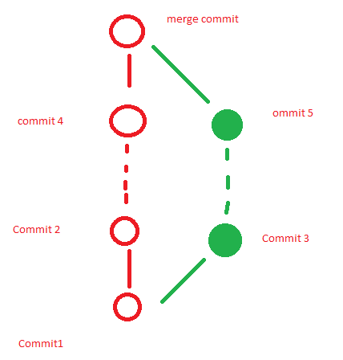
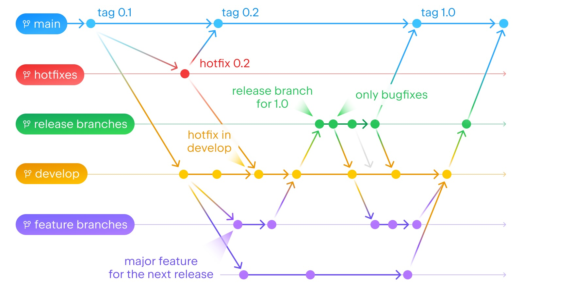
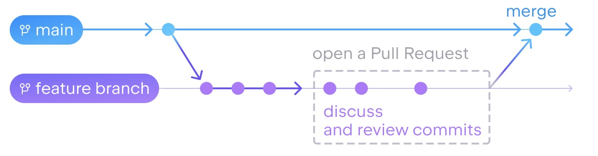
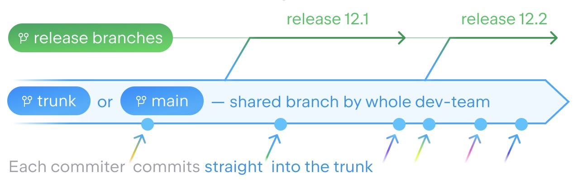
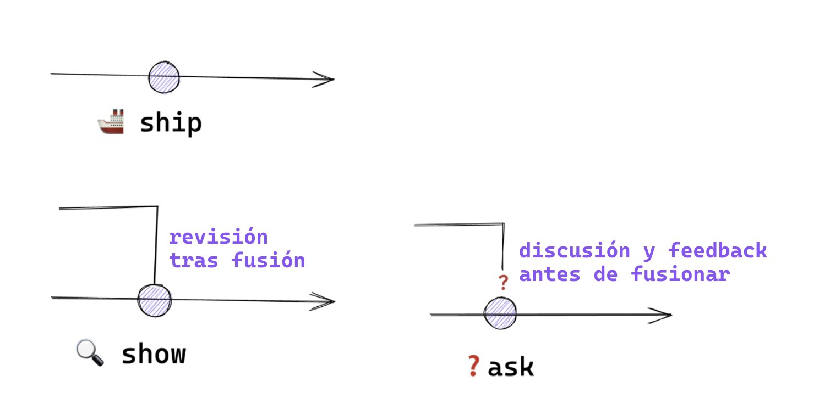

# Git y Github

## Git

Git es un sistema de control de versiones distribuido, diseñado por Linus Torvalds, el creador del kernel del sistema operativo Linux. Fue creado pensando en la eficiencia, la confiabilidad y la compatibilidad del mantenimiento de versiones de aplicaciones que tienen un gran número de archivos de código fuente.
La principal función de Git es llevar registro de los cambios en archivos de computadora y coordinar el trabajo que varias personas realizan sobre archivos compartidos en un repositorio de código. Cada copia de trabajo del código de un desarrollador es también un repositorio que puede contener el historial completo de todos los cambios.

### Instalacion

Se puede descargar e instalar git desde en la siguiente pagina [https://git-scm.com](https://git-scm.com) (El proceso puede variar dependiendo del sistema operativo que se use)

### Configurar git

Una vez instalado git por primera vez antes de inicializar un proyecto git deberemos realizar algunas configuraciones por unica vez.

#### Comandos

- Poner o cambiar nombre: `git config --global user.name "tu nombre"`

- Poner o cambiar email: `git config --global user.email “tu email”`

- cambiar el nombre por defecto de la rama principal en configuraciones: `git config --global init.defaultBranch main` (esta es una configuracion global lo que implica que al iniciar los siguientes proyectos en git el nombre por defecto de la rama principal sera como la que pusimos, en este caso "main", este comando no cambiara el nombre de las ramas de los proyectos git ya existentes, si quieres cambiar el nombre de una rama ya existente puedes usar `git branch -m nuevo_nombre`)

- Ver todas las configuraciones hechas = `git config --list` (Para salir se preciona tal tecla `esc` y luego la tecla `q`)

### Primeros Pasos

- Iniciar un proyecto git: `git init`

- Ver el estatus de los archivos: `git status`

La siguiente imagen es el grafico basico de como funciona el flujo de git 

### Stage

El término “stage” o área de preparación se refiere al proceso de seleccionar y preparar archivos que han sido modificados para un próximo commit. Imagina que el stage es como una sala de espera donde los archivos modificados aguardan antes de ser confirmados y guardados permanentemente en el historial de tu repositorio.

#### Comandos

- Añadir archivos al staged: `git add .` (es necesario hacer este add para todos los archivos nuevos recién creados en nuestro directorio) (caso de no querer añadir ciertos archivos o directorios sera necesario un .gitignore)

- Eliminar un archivo individualmente del staged `git rm --cached fileName.extension` (deja de rastrear un archivo específico en Git sin eliminarlo del sistema de archivos ni del área de preparación. Es útil cuando se desea mantener el archivo en el sistema de archivos pero ya no se quiere rastrear en
  
  Git.)

- Eliminar directorio completo del staged: `git rm -r --cached nombre_directorio` (se usa un `.` en lugar del nombre del directorio para eliminar todo el staged y dejarlo vacio)

### Commits

Un commit en Git es como un punto de control en el desarrollo de tu proyecto, que captura el estado actual de tu repositorio en un momento específico. Puedes pensar en un commit como una fotografía del código que incluye todos los cambios que has hecho hasta ese momento.
Por lo general se realiza un commit cuando estás creando un registro en el historial de tu proyecto que incluye:

- Los cambios exactos en los archivos (añadidos, modificados, eliminados).

- Una referencia a este conjunto de cambios como una entidad única.

- Un mensaje descriptivo que explica qué cambios se han realizado y por qué.

- Este proceso te permite volver a cualquier commit anterior si necesitas restaurar el estado de tu proyecto a cómo estaba en ese punto, o si quieres entender la evolución de tu código a lo largo del tiempo.

#### Comandos

- Realizar un commit con su mensaje: `git commit -m “mensaje para mas informacion sobre el commit”`

- Añadir los archivos al staged y realizar el commit: `git commit -am “mensaje para mas informacion sobre el commit”` (esto solo funciona para archivos ya añadidos anteriormente, no tendrá efecto sobre los archivos nuevos que nunca pasaron por el “git add”)

- Ver los cambios que sucedieron sobre un archivo: `git show filename.extension`

- Ver el historial de todos los commits hechos: `git log`(+ `filename.extension` para ver de un archivo en especifico)

- Ver todos los commits hechos de forma grafica: `git log --all --graph --decorate --oneline`

- Comparar cambio entre 2 commits mediante su hash: `git diff old_commit_hash recent_commit_hash`

- Resetear hasta un commit hecho (ejemplo: tenemos commit 1 y commit 2, nos encontramos en commit 2 si hacemos un reset a commit 1 el commit 2 se eliminara y nos encontraremos en commit 1):
  
  - `git reset --hard commit_hash` (elimina absolutamente todo, hasta lo de staged),
  
  - `git reset --soft commit_hash` (elimina todo menos no lo que se encuentra en staged que esta listo para tu siguiente commit)

- Arreglar un commit que ya enviamos sin necesidad de crear uno nuevo: git `commit --amend` (este comando arreglara el último commit que hayamos hecho y además te permite arreglar también el mensaje del commit)

- Traer commits viejos al head de una rama: `git cherry-pick hash_del_commit`

### Navegacion

- Retroceder todo el repositorio a un commit anterior:`git checkout commit_hash`

- Retornar al head del la rama main:`git checkout master`

- Retroceder un archivo individual a un commit anterior: `git checkout commit_hash filename.extension`

- Retornar el archivo individual al head de la rama main:`git checkout master filename.extension`

### Ramas

Una rama en Git es básicamente una línea de desarrollo independiente dentro de un proyecto. Puedes pensar en las ramas como diferentes caminos que puedes tomar para trabajar en distintas características, correcciones de errores, o experimentos sin afectar la línea principal de desarrollo, que generalmente es la rama master o main.
Cuando creas una nueva rama, estás haciendo una copia del estado actual de tu proyecto (o del punto específico de la rama desde la cual la creas) y cualquier cambio que hagas en esa rama no afectará a otras ramas. Esto te permite trabajar de manera aislada. Por ejemplo, podrías tener una rama para desarrollar una nueva característica mientras otra persona trabaja en la corrección de un error en otra rama.

#### Comandos

- Crear una rama: `git branch nombre_rama` (es comun para arreglar bugs de ultimo minuto crear una rama llamada hotfix)

- Eliminar una rama: `git branch -d nombre_rama` (este comando solo te dejara eliminar si ya se hizo un merge previo de la rama para forzar la eliminacion se usa un `-D `en lugar de `-d`)

- Listar las ramas existentes: `git branch` (+ `-a` lista las ramas locales como las ramas remotas, pero para tener la lista actualizada se deberia hacer un fetch antes)

- Cambiar entre ramas: `git checkout nombre_rama` o `git switch nombre_rama`

- Cambiar el nombre de una rama: `git branch -m antiguo_nombre nuevo_nombre`

### Merge

Un merge en Git es el proceso de combinar dos líneas de desarrollo independientes, generalmente ramas, en una sola. Al realizar un merge, Git intenta automáticamente integrar los cambios de las ramas involucradas. Si ambas ramas han modificado las mismas partes de los mismos archivos, entonces puede surgir un conflicto que requiere intervención manual para resolver.

- Hacer un merge: `git merge nombre_rama`

- Resolver conflictos: 
  
  
  
  Un conflicto se da cuando al hacer el merge hay 2 partes del código el cual tienen modificaciones y git pregunta sobre cómo debería hacer el merge ese conflicto donde tenemos 3 opciones: mantenemos lo que ya teníamos, aceptamos lo entrante o mantenemos ambos. Por lo general cuando se da un conflicto en el proceso del merge tenemos un merge incompleto en el cual tendremos que aplicar los siguientes pasos:
  
  1. Resolver el conflicto en base a nuestro criterio
  2. Realizar un {git commit -am “mensaje”} para indicarle a git que ya arreglamos el conflicto del merge
  
  Con eso ya se completaría el proceso del merge una vez resuelto el conflicto

## Github

Es una plataforma de alojamiento de código para el control de versiones y la colaboración. Permite a los desarrolladores almacenar y gestionar su código, así como rastrear y controlar los cambios en el código. Es como una red social para el código donde los desarrolladores pueden colaborar en proyectos, discutir mejoras y compartir ideas.
En GitHub, puedes:

- Almacenar tu código en repositorios, que son como carpetas o proyectos que contienen todos los archivos relacionados con un proyecto.

- Colaborar con otros desarrolladores, permitiendo que múltiples personas trabajen en el mismo proyecto desde diferentes ubicaciones.

- Controlar los cambios en el código, utilizando Git para llevar un registro de cada modificación y permitir revertir a versiones anteriores si es necesario.

- Contribuir a proyectos de código abierto, donde cualquier persona puede sugerir cambios y mejoras a través de "pull requests".

La siguientes imagenes son unos grafico mas completo de como se veria el flujo entre git y github

### Generar y conectar clave SSH

Para establecer una coneccion entre nuestra maquina local con nuestro github hay diferentes formas una de ellas es la generacion de una clave ssh, el siguiente link es la documentacion oficial de github para hacer esto ya que el proceso varia dependiendo del sistema operativo que estemos usando: https://docs.github.com/es/authentication/connecting-to-github-with-ssh/generating-a-new-ssh-key-and-adding-it-to-the-ssh-agent

y la siguiente documentacion es el como conectar nuestra clave con nuestra cuenta de github: https://docs.github.com/es/authentication/connecting-to-github-with-ssh/adding-a-new-ssh-key-to-your-github-account

(Es una buena practica generar una clave por cada maquina que queramos vincular con nuestra cuenta, y no mover nuestra clave privada fuera de nuestra maquina esto por razones de seguridad)

### Readme

Un archivo README.md es un documento importante que se encuentra generalmente en la raíz de un repositorio. Su propósito es ofrecer una visión general del proyecto para que cualquier persona que visite el repositorio pueda entender rápidamente de qué se trata y cómo puede contribuir o utilizarlo.
Algunos elementos clave que suelen incluirse en un archivo README:

- <u>Descripción del Proyecto</u>: Explica qué hace el proyecto y por qué es útil.
  Instrucciones de Instalación: Proporciona los pasos necesarios para instalar y configurar el proyecto.

- <u>Uso</u>: Muestra cómo usar el proyecto, con ejemplos de código o comandos.
  Contribución: Guía a los colaboradores potenciales sobre cómo pueden ayudar con el proyecto.

- <u>Licencia</u>: Informa a los usuarios sobre los términos bajo los cuales pueden usar y contribuir al proyecto.

- <u>Contacto</u>: Ofrece información sobre cómo obtener ayuda o contactar a los mantenedores del proyecto.

El archivo README es a menudo el primer punto de contacto entre el proyecto y un visitante, y por lo tanto, es una herramienta de comunicación esencial para los desarrolladores que quieren compartir su trabajo con la comunidad.

### Repositorios

- Añadir una url de repositorio remoto (github,gitlab,etc): `git remote add origin url_repositorio` (en origin puede ir cualquier nombre simplemente origin es un standar, en el caso de usar una clave ssh tendremos que copiar esta opcion de nuestro repositorio en github para ponerlo en url_repositorio)

- Editar la url de un repositorio remoto: `git remote set-url nombre_remoto url_repositorio` (remoteName es el nombre de la rama remota ya creada)

- Eliminar un repositiorio remoto: `git remote remove nombre_repositorio`

- Listar todos los repositorios añadidos: `git remote`

- Listar los repositorios añadidos mas sus urls: `git remote -v`

- Actualizar la informacion local con la del repositorio remoto: `git fetch -p` (el `-p` es el comando prune que sirve para elimiar las ramas ya obsoletas)

### Interaccion

- Traer todos los cambios del repositorio remoto: `git pull nombre_repositorio_remoto nombre_rama_local` (ponemos el nombre que le dimos a nuestro repositorio remoto en nuestro local y posteriormente a que rama de nuestro local queremos traer los cambios, es una buena practica que mienstras desarrollamos antes de hacer un push de un commit hecho hagamos un git pull previo por si alguien mas hizo algun cambio)

- Forzar el traer los cambios del repositorio remoto: `git pull nombre_repositorio_remoto nombre_rama_local --allow-unrelated-histories` (se usa cuando los commits entre el remoto y el local no coinciden)

- Pushear al repositorio remoto: `git push nombre_repositorio_remoto nombre_rama_local:nombre_rama_remota` (en caso de que la rama del respositorio remoto comparta el mismo nombre de la rama local que queremos pushear podemos omitir el `:nombre_rama_remota`)

- Forzar un push al repositorio remoto: `git push -f nombre_repositorio_remoto nombre_rama_local:nombre_rama_remota` (Esto es una mala practica y solo se debe usar en casos muy particulares)

- Clonar un repositorio: `git clone url`

### Ramas

- Eliminar ramas obsoletas de la lista de nuestro repositorio remoto: `git remote prune nombre_repositorio_remoto`

- Cambiar a una rama remota que no la tenemos en local: `git switch rama_remota` o `git checkout rama_remota` (basicamente son los mismos comandos que los del apartado de git)

- Eliminar una rama en remoto: `git push :nombre_repositorio_remoto/nombre_rama`

### Pull Requests

Una Pull Request, o de forma abreviada PR, es una petición de cambios que se envía al repositorio original. Estos cambios que queremos llevar a cabo los tenemos que agrupar en commits, en una rama, en nuestro fork. Con esos cambios podremos crear nuestra petición.

Al hacer push a nuestro repositorio remoto, nos indica que podemos crear una Pull Request visitando la URL que nos ha indicado en la terminal.

En una pullrequest tendremos 3 partes importantes:

1. **Ramas**: Especificar la rama a la que queremos pushear los cambios, y especificar la rama de la que queremos traer los cambios.

2. **Título**: Es una descripción corta y concisa de los cambios que se han realizado. Debe ser claro y dar una idea de lo que se ha cambiado.

3. **Descripción**: Aquí se proporciona una explicación más detallada de los cambios. Puedes incluir el motivo de los cambios, el problema que resuelve, y cualquier otra información relevante.

## Comandos Complementarios Utiles

### Tags

Las etiquetas son muy útiles cuando quieres marcar ciertos puntos en la historia como versiones importantes de tu proyecto. Por ejemplo, podrías crear una etiqueta para marcar la versión `v1.0.0` de tu software. Luego, siempre puedes hacer un `git checkout v1.0.0` para obtener el código tal cual estaba en ese punto.

- Añadir un tag a un commit: `git tag -a nombre_del_tag -m “mensaje_del_tag” hash_del_commit`

- Eliminar un tag: `git tag -d nombre_del_tag`

- Ver todos los tags creados: `git tag`

- Ver el hash de todos los tags creados: `git show-ref --tags`

- Pushear los tags al repositorio remoto: `git push nombre_repositorio_remoto --tags`

- Eliminar un tag del repositorio remoto: `git push nombre_repositorio_remoto:refs/tags/nombre_del_tag`

### Stash

Es una forma de guardar temporalmente cambios no confirmados para que puedas cambiar de contexto y luego volver a esos cambios más tarde. Es una herramienta muy útil para manejar cambios en el código que aún no estás listo para confirmar.

- Hacer un stash: `git stash`

- Ver los stash creados: git stash list: `git stash list`

- Soltar los cambios en el stash: `git stash pop`

- Crear una rama con los cambios que tenemos en el stash: `git stash branch nombre_rama`

- Comando para borrar los stash: `git stash drop`

### String Filter

- Buscar una palabra en todo el repositorio: `git grep -n palabra` (para símbolos especiales hay que usar “string“)

- Buscar cuantas veces aparece una palabra en un archivo: `git grep -c palabra` (para símbolos especiales hay que usar “string“)

- Buscara palabras en los mensajes de los commits: `git log -S palabra`

### Utiles

- Hacer un rebase: `git rebase branchName` (para hacer un buen rebase primero hacemos el rebase en la rama que haremos desaparecer y después nos movemos a la rama master y le hacemos un rebase de la rama que haremos desaparecer )

- Previsualizar los archivos que se van a limpiar basado en la memoria de tus commits en git: `git clean --dry-run`

- Limpiar archivos basura basado en la memoria de tus commits en git: `git clean -f`

- Ver el historial de todo lo ocurrido en git: `git reflog`

## Flujos de trabajo

### Git Flow

Es una estrategia de ramificación útil para equipos que tienen procesos de lanzamiento claros y necesitan mantener estables sus entornos de producción. Sin embargo, la dependencia de múltiples ramas y reglas añade mucha complejidad al proceso. Esto puede resultar abrumador para los nuevos miembros del equipo y puede generar conflictos debido al incumplimiento de los principios de integración continua.

- `main`: es solamente para codigo de produccion.

- `develop`: es para codigo en desarrollo.

- `feature`: son ramas creadadas de la rama `develop`  y sirve para implementar nuevas caracteristicas a nuestro proyecto.

- `hotfix`: son ramas creadas de la rama `main` y sirve para arreglar bugs  detectados en produccion en caliente.

- `release`: son ramas creadas de la rama `develop` y se utiliza para preparar el próximo lanzamiento del producto.

### Github Flow

Es una estrategia de ramificación ligera adecuada para equipos que practican la implementación continua. Esta estrategia enfatiza la colaboración, los lanzamientos frecuentes y un proceso de desarrollo optimizado. Dada su simplicidad, el flujo de GitHub funciona mejor para equipos y proyectos pequeños. Sin embargo, a medida que aumentan el tamaño y la complejidad, puede resultar complicado gestionar los cambios en todo el código base con este flujo.

- La rama `main` es solo para el código de producción.

- El desarrollo se realiza en ramas de `features` separadas que luego se fusionan en la rama `main` cuando esté lista.

- Las pull requests se utilizan para las revisiones de código y deben cumplir con las reglas de protección de la rama antes de fusionarse.

- Los lanzamientos se cortan de la rama `main` y se etiquetan para facilitar el control de versiones.

### Basado en Trunk

 Es un modelo de ramificación en el que los desarrolladores colaboran en el código en una única rama llamada `trunk`. Esta estrategia requiere esfuerzos directos `trunk`y colaboración entre los desarrolladores para mantener una `trunk`rama estable. Dado que los cambios se integran continuamente en el sistema `trunk`, existe un mayor riesgo de introducir cambios que puedan afectar la estabilidad de todo el sistema.

- Todo el código está comprometido con una sola rama, generalmente llamada `trunk`.

- La rama `trunk` siempre está lista para la producción.

- El trabajo de desarrollo se realiza directamente en la rama `trunk`.

- No hay ninguna rama `feature` de larga duración.

- Antes de pushear los cambios, los desarrolladores realizan una preintegración completa  (compilar, pruebas unitarias, etc.) en sus máquinas locales.

- Después de que los cambios ya estén en la rama `trunk`, puede haber una revisión del código posterior a la integración.

### Ship Show Ask

Es una estrategia de ramas que combina la idea de crear Pull Request con la habilidad de seguir publicando cambios rápidamente. Fue presentada por Rousan Wilsenach en el blog del mítico Martin Fowler.

Los cambios que creamos en el repositorio se categorizan en tres:

- `Ship`: Se fusiona en la rama principal sin revisión
- `Show`: Abre una petición de cambios para que sean revisados por CI pero se fusiona inmediatamente
- `Ask`: Abre una PR para discutir los cambios antes de fusionarlos
